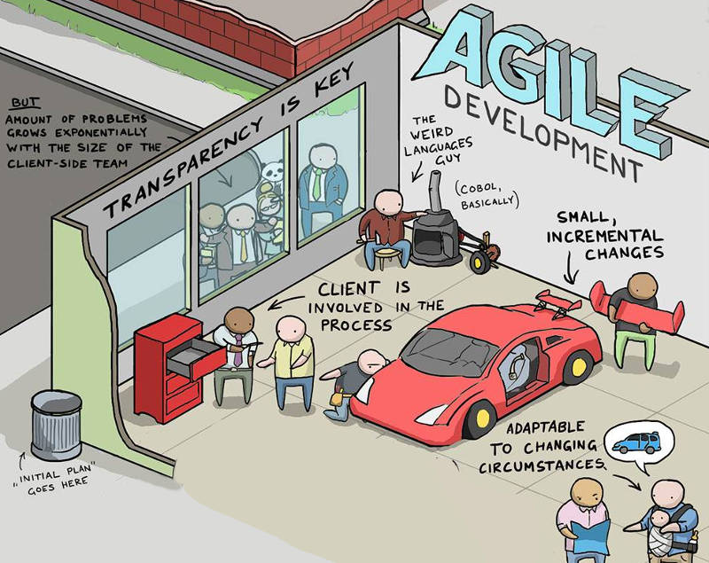

# Welcome

7th March 2018, Eschborn, Taunus Tower. A design thinking workshop took place. Variety of invited people tried to answer 
one question: *How to increase quality of our services based on customer feedback*. Current solution included a survey, 
however based on existing experience, response rate is quite low and most importantly, one can hardly measure an impact 
of customer's feedback to existing service, which questions the existence of survey itself.  

One of proposals at the end of the workshop was to skip survey completely and allow customers to increase quality of 
our products directly. By utilizing standard GitHub workflow, any customer is not only able to raise a new issue (that 
basically is a **change request**), but can also see, who is responsible for dealing with the issue, what is the status, 
when release is planned and overall it brings 100% transparency to customer, managing their expectations and overall 
increasing quality of product itself.  

This process is shortly described in this document. Please continue to [customer's story](story1.md) or simply use the 
navigation sidebar to read more details.

### In a nutshell...

<small>Image courtesy of Mart Virkus ([blog](https://toggl.com/)) = [original](https://i.imgur.com/IMPvTZd.jpg)</small>

### Document hosting

This document is hosted on [GitHub Pages](https://do-team.github.io/productitself/).
