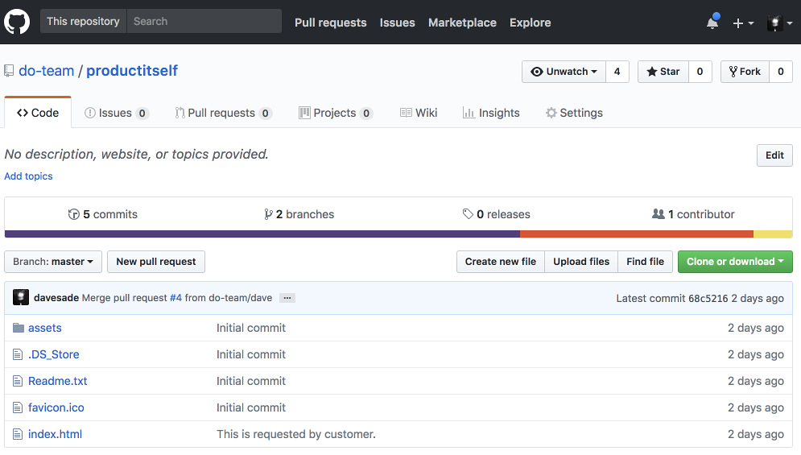
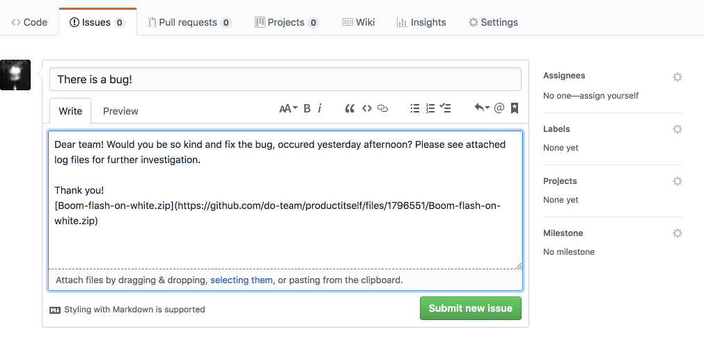
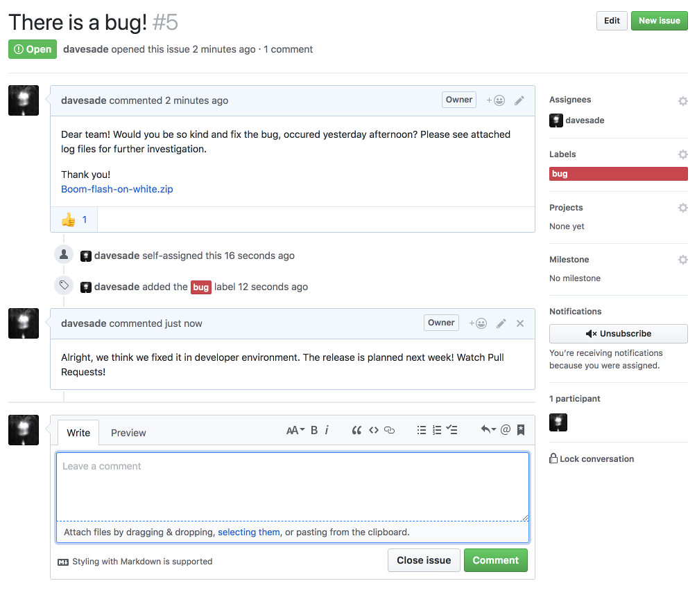
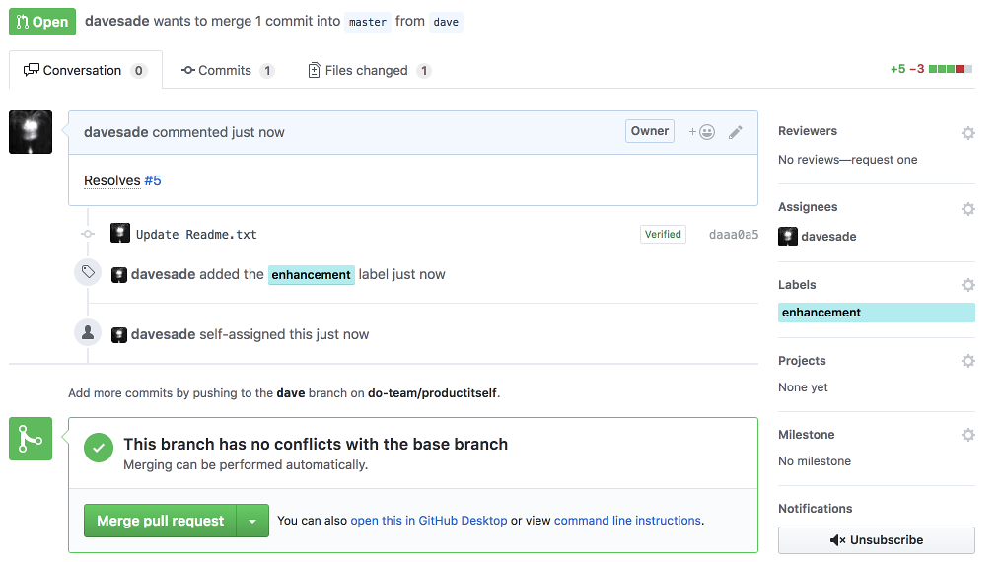

# Customer's storyline

## Something happens!

During normal operations it will happen occasionally, that customer encounters new issue. The issue can be anything - 
unexpected response from the system, general slowness, missing feature, etc. Sometimes it might be related to the 
documentation only, sometimes it might be simple misunderstanding of the product functionality. In any case, there is 
only one way, how customer can find out, what's going on. Which is - raising an issue on GitHub repository, which in 
this case represent a home of the product.

## New issue!

It is a best practise to check, if the issue is already created by somebody else. Customer can also search / filter and 
sort issues in the repository to see, what was already reported. He is allowed to comment and upvote existing issues, 
having opportunity to contact DBAG or other customers with same needs.

## Monitor issue updates

After issue is saved, it can be never removed or simply deleted. Customer can now simply monitor the status of the issue, 
he can see, who is dealing with it, he can provide updates, clarifications etc. At one point of time, DBAG will accept 
or reject the issue. If rejected, customer can clearly see reasons for it.

## Delivery of the change

Once issue is accepted by DBAG, the release is planned. This is again completely transparent to customer. The process 
ends with **Pull Request**, which is part a standard GitHub workflow. The pull request contains link to the issue, which 
it is related to. When pull request is merged, customer can see that his issue (change request) was delivered to 
production. Related issue is then closed.

## Post action

Any issue can be found in the GitHub, even if it's closed. Customer can reopen the issue, he can still comment on it or 
share the information with others.