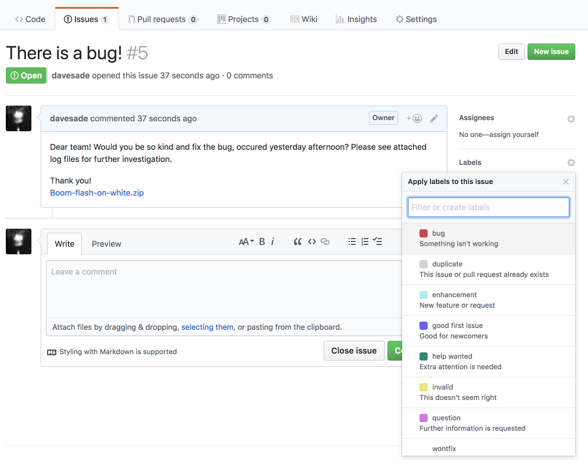
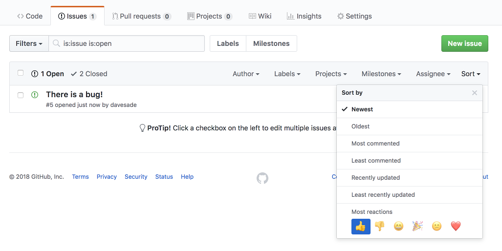
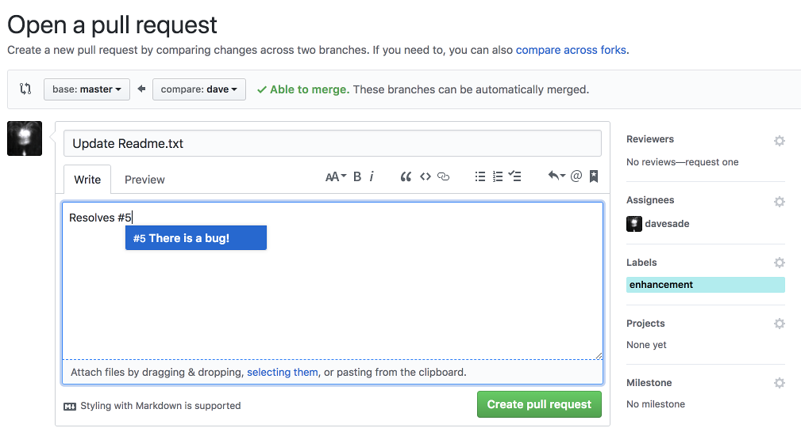
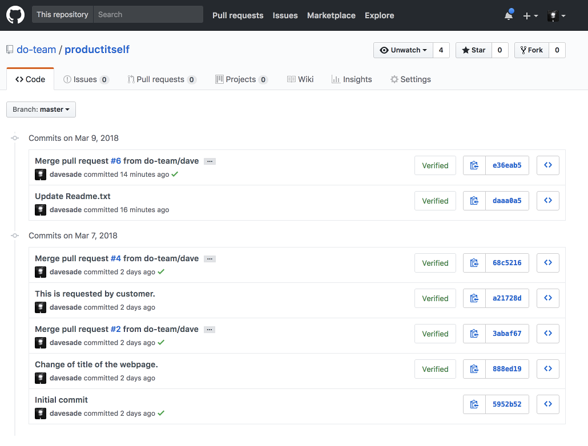

# DBAG's storyline

## New issue!

Each product / service has it's own home in GitHub repository, which has team of people assigned. There are developers, 
operations, customer support, project manager, release planner etc. When new issue arrives, first it has to be 
categorized. This is usually a topic for daily standups on product side.   
**Note:** It is not only customer, who is allowed to raise an issue. In fact, it can be anybody. A trigger for new issue 
might be simply regulatory requirement, result of internal testing or anyone from product team.

## Analysis

Issue has to be analysed to find out, who will take care of specific issue, what kind of action is required. Based on 
category, upvoting and existing information, DBAG interacts with customer directly in the issue to clarify details and 
inform customer. If the issue is to be closed, a reason must be specified, to satisfy customer.

## Planning

GitHub has internal tools (labels, milestones, projects) to organize workflow - this is not covered by this document. As 
a result, a release is planned and **Pull Request** is raised. Pull request is then connected to original issue, creating 
a link between customer's interaction (issue / change request) and specific release.

## Release

Once pull request is merged (delivered to production), original issue is closed. Issue itself will never disappear, it 
can be reopened, commented or shared with others. Anyone can check the history of changes.

